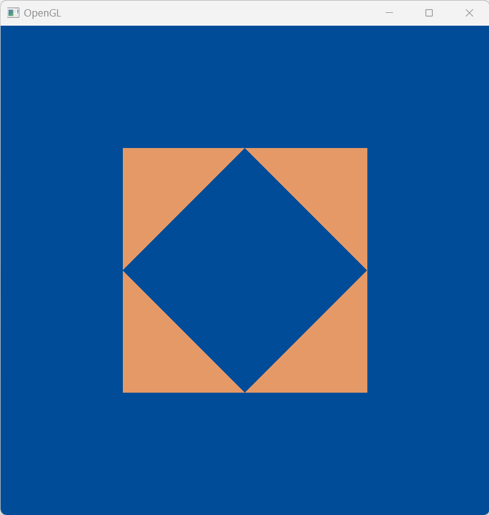
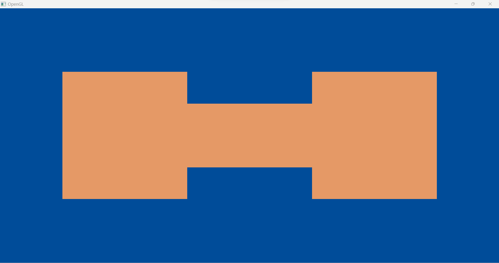
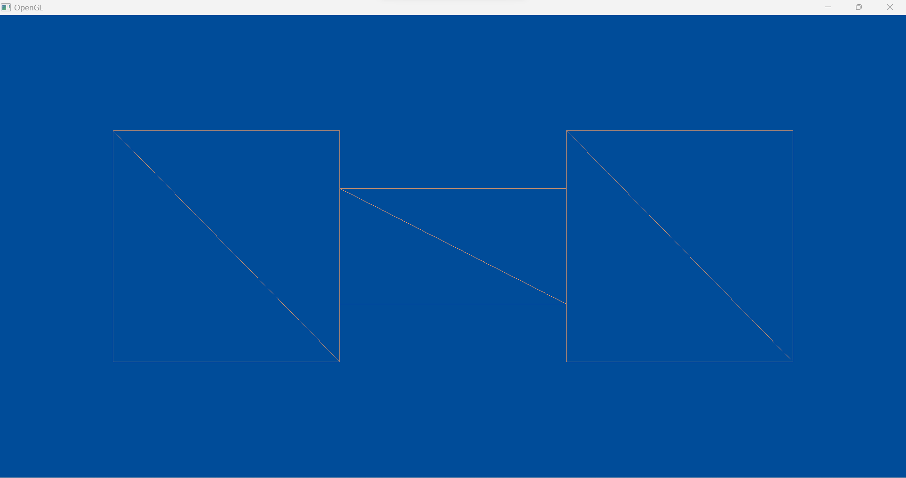

# Creating First Window


# Drawing Triangles

**A picture of 4 triangles drawn on the screen with the coordinates:**

```
        // first triangle
        0.0f, -0.5f, 0.0f, // bottom left
        0.5f, 0.0f, 0.0f, // top right
        0.5f, -0.5f, 0.0f, // bottom right

        // second triangle
        0.0f, -0.5f, 0.0f, // bottom right
        -0.5f, 0.0f, 0.0f, // top left
        -0.5f, -0.5f, 0.0f, // bottom left

        // third triangle
        -0.5f, 0.0f, 0.0f, // bottom left
        0.0f, 0.5f, 0.0f, // top right
        -0.5f, 0.5f, 0.0f, // top left

        // fourth triangle
        0.0f, 0.5f, 0.0f, // top left
        0.5f, 0.0f, 0.0f, // bottom right
        0.5f, 0.5f, 0.0f // top right
    };
```



**A picture of 3 rectangles drawn on the screen with the coordinates:**

```
    float vertices[] =
    {
        // First rectangle
        -0.25f,  0.5f, 0.0f, // top right
        -0.25f, -0.5f, 0.0f, // bottom right
        -0.75f, -0.5f, 0.0f, // bottom left
        -0.75f,  0.5f, 0.0f, // top left

        // Second rectangle
        0.25f,  0.25f, 0.0f, // top right
        0.25f, -0.25f, 0.0f, // bottom right
        -0.25f, -0.25f, 0.0f, // bottom left
        -0.25f,  0.25f, 0.0f, // top left

        // Third rectangle
        0.75f,  0.5f, 0.0f, // top right
        0.75f, -0.5f, 0.0f, // bottom right
        0.25f, -0.5f, 0.0f, // bottom left
        0.25f,  0.5f, 0.0f, // top left
    };
    
    unsigned int indices[] =
    {
        0, 1, 3, // First triangle
        1, 2, 3, // Second triangle

        4, 5, 7, // Third triangle
        5, 6, 7, // Fourth triangle

        8, 9, 11, // Fifth triangle
        9, 10, 11 // Sixth triangle
    };
```



**Here is another picture for the rectangles being drawn in wireframe mode. This mode shows clearly that the rectangle is actually being drawn as two triangles by drawing lines only rather than filled triangles:**

